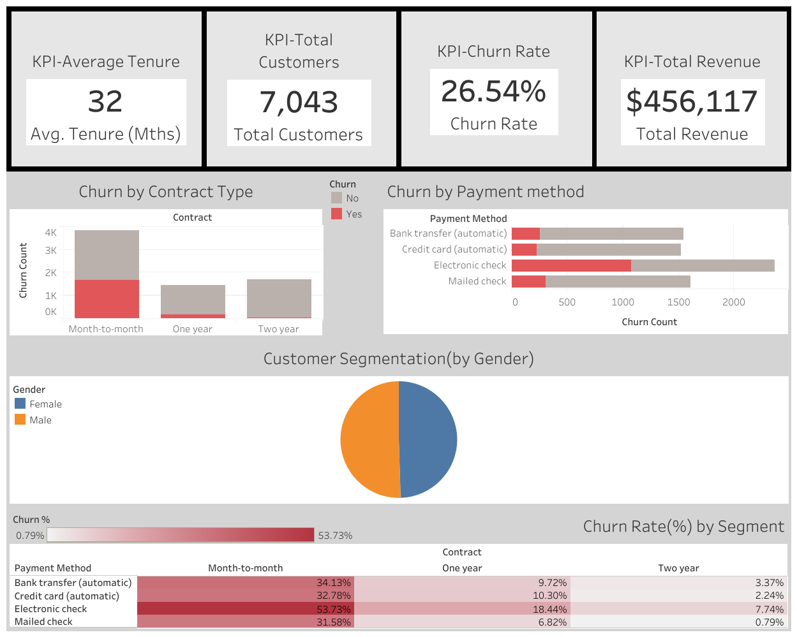

# Data Visualization Dashboard: Customer Behavior & Churn Analysis

## Project Overview
This project creates an interactive dashboard that visualizes customer behavior, sales trends, and churn patterns. It demonstrates end-to-end data engineering and analytics skills using **Python**, **SQL**, and **Tableau**.

## Features
- SQL database with customer & sales data
- Python preprocessing script for data cleaning & derived metrics
- Tableau dashboard with interactive filters & KPIs
- Insights & actionable recommendations based on data trends

## Tech Stack
- SQL (PostgreSQL/MySQL/SQLite)
- Python (pandas, numpy, SQLAlchemy)
- Tableau Desktop / Tableau Public
- Git/GitHub

## Folder Structure
Data_Visualization_Dashboard/
├─ data/ # Raw & cleaned datasets
├─ sql/ # SQL scripts
├─ python/ # Data preprocessing scripts
├─ tableau/ # Tableau dashboard
├─ .gitignore
└─ README.md

## How to Run
1. Clone the repository  
2. Load raw data in `data/` folder  
3. Run `python/data_preprocessing.py` to clean data  
4. Load `cleaned_telco_customer_churn.csv` into SQL database  
5. Connect Tableau to the SQL database to build dashboard

## Insights & Recommendations
- Identify high-risk churn segments  
- Analyze sales trends by contract type & region  
- Provide retention & upselling strategies

## Dashboard Preview

